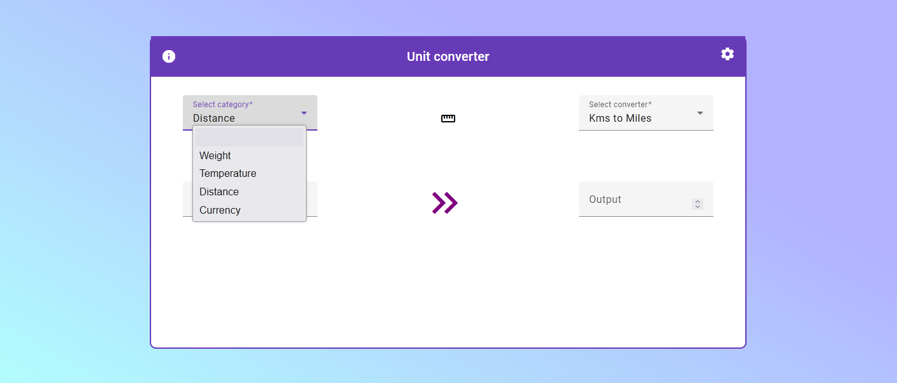
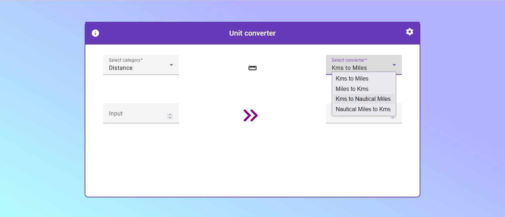
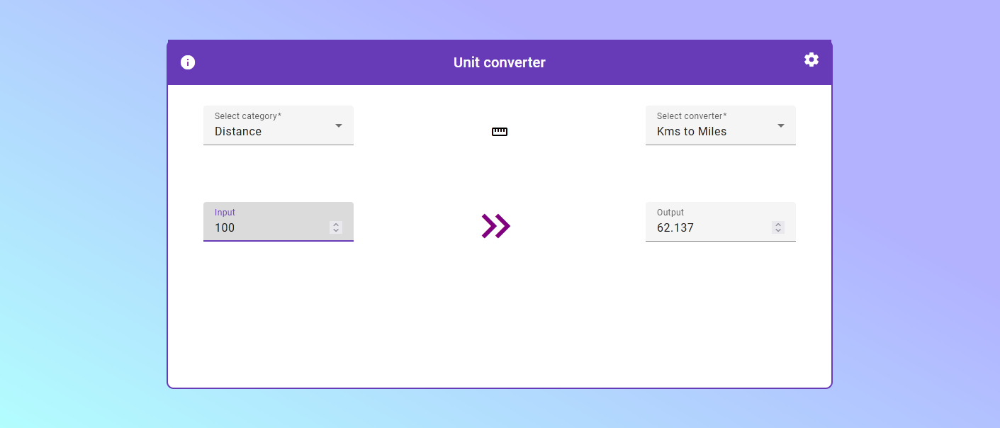
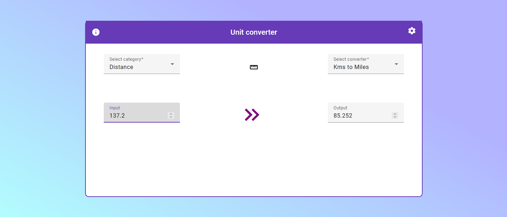

# Unitconverter App

Simple unitconverter app where user is able to convert units based on categories.

## Quick install

You Need:
 - Node
 - npm
 - AngularCLI (optional)

Clone repo: `git clone https://github.com/oksuriini/AngularConverter.git`

Install dependencies: `cd AngularConverter && npm i`

Run: `ng serve` or `npm run start`

## Alternatively:

Run the dockerized version of this repo with command below:

`docker run -d --rm -p 80:80 --name angular-converter oksuriini/unitconverter:1.0`

[Docker repo](https://hub.docker.com/repository/docker/oksuriini/unitconverter/general)

### Quick example

Select category for converters from a list.

Select converter from a list.

Type in amount you want to convert.

The output will show converted value.

# Generated angular stuff below

## Development server

Run `ng serve` for a dev server. Navigate to `http://localhost:4200/`. The application will automatically reload if you change any of the source files.

## Code scaffolding

Run `ng generate component component-name` to generate a new component. You can also use `ng generate directive|pipe|service|class|guard|interface|enum|module`.

## Build

Run `ng build` to build the project. The build artifacts will be stored in the `dist/` directory.

## Running unit tests

Run `ng test` to execute the unit tests via [Karma](https://karma-runner.github.io).

## Running end-to-end tests

Run `ng e2e` to execute the end-to-end tests via a platform of your choice. To use this command, you need to first add a package that implements end-to-end testing capabilities.

## Further help

To get more help on the Angular CLI use `ng help` or go check out the [Angular CLI Overview and Command Reference](https://angular.io/cli) page.
